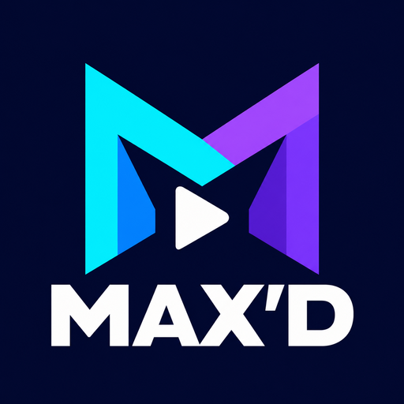

  

<h1 align="center">Nuvio Max'd</h1>

<strong>Your Nuvio library, addons and watch progress. Now on PS5.</strong>

  
  
  

  <strong>Available to download now</strong> · v0.5.14 experimental 
  <a href="USER_GUIDE.md">User guide</a> · <a href="https://github.com/HandshakeHackin/Nuvio-maxd-releases/releases/tag/v0.5.14-native-experimental">Release notes</a> · <a href="https://homebrew.page/app/PPSA99288/">ProsperoStore listing</a>

Bring your Nuvio setup to the big screen. Sign in with your phone, browse your
addons and saved library, and keep your movie and episode progress in sync with
your other Nuvio devices. Nuvio Max'd runs directly on a jailbroken PS5, with a
built-in player and a controller-friendly interface.

**Version 0.5.14 is available from the GitHub downloads above.**
The [ProsperoStore listing](https://homebrew.page/app/PPSA99288/) currently pins
0.5.9; its catalog update is separate from this public release.

## Key features

| Feature | What you get |
| --- | --- |
| **Easy sign-in** | Scan a QR code with your phone. Your login stays saved between launches. |
| **Your addons and library** | Load enabled standard addons and saved titles from your primary Nuvio profile, including setups using AIOMetadata and AIOStreams. Add manifests in Settings. |
| **Browse and search** | Explore addon catalogs, find films and series, and open your saved library. |
| **Nuvio Sync watch progress** | Resume movies and episodes across Nuvio devices using the same account and primary profile. Progress saved offline syncs when you reconnect. |
| **Direct and debrid playback** | Play addon links or connect TorBox/Premiumize to resolve cached original files. Prepare links while browsing; peer-to-peer torrents are off by default. |
| **Clear stream cards** | Compare file size, language, quality, HDR, video codec and audio badges when the addon provides those details. Filter results by addon. |
| **Artwork made for TV** | Smooth poster carousels, large artwork, gentle transitions and translucent playback controls. |
| **A proper series view** | Choose a season, browse episode thumbnails and descriptions, and see watch-progress bars. |
| **Skip Intro, Recap and Credits** | Skip buttons appear when IntroDB has timings for the episode. Known post-credit scenes are kept. |
| **Next-episode autoplay** | Find the next episode during credits and show a countdown when a stream matching the advertised quality is ready. You can cancel or turn autoplay off. |
| **A built-in video player** | Play compatible H.264 and HEVC streams, choose audio and subtitle tracks, and view playback details. |
| **4K and display controls** | Keep decoded picture dimensions, follow the PS5 resolution or choose an override, and request 120 Hz on compatible displays. |
| **Experimental HDR10** | Native HDR10 output for compatible sources and displays, with an explicit HDR-to-SDR option in Settings. |
| **Updates from the app** | Check the public release feed in Settings. Verified FFPFSC installation through the bundled helper is experimental; ZIP installs use manual replacement. |

## What changed in 0.5.14

This release corrects the package's missing HDR-capable application declaration
for the native HDR10 rejection reported on firmware 11.00. It includes revised
explicit HDR-to-SDR colour conversion, optional 120 Hz, controller symbols on
episode prompts, and Connected Services with cached-link preparation.

**Native HDR acceptance and remaining motion judder still need console testing.**
The package correction preserves native 4K/PQ/10-bit packing; it is not a claim
that the console/TV output is already verified.

## Download and get started

You'll need a jailbroken PS5, a compatible **kstuff-lite 1.07+** setup and
[ShadowMount+](https://github.com/drakmor/ShadowMountPlus).

**Target firmware: 9.00 and above**, where the required jailbreak and homebrew
tools work. **Firmware below 9.00 needs testing.** Console feedback so far covers
11.00 and 11.20; the full target range has not been verified.

| Download | Install it this way |
| --- | --- |
| [**ZIP folder — PPSA99288.zip**](https://github.com/HandshakeHackin/Nuvio-maxd-releases/releases/download/v0.5.14-native-experimental/PPSA99288.zip) | Extract it and place the `PPSA99288/` folder inside a `/homebrew/` folder scanned by ShadowMount+, such as `/data/homebrew/`. |
| [**FFPFSC image — NuvioMaxd-0.5.14-native.ffpfsc**](https://github.com/HandshakeHackin/Nuvio-maxd-releases/releases/download/v0.5.14-native-experimental/NuvioMaxd-0.5.14-native.ffpfsc) | Place the image inside a `/homebrew/` folder on storage scanned by ShadowMount+. |

Let ShadowMount+ finish scanning, open **Nuvio Max'd**, and scan the sign-in QR
code with your phone. Configure your addon through your usual Nuvio setup. For cached-file resolution,
open Settings → Connected Services and connect TorBox or Premiumize, or import
supported connections from Nuvio Sync.

**Updating an existing install?** Close the app, delete the old FFPFSC and replace
it with the new one. For ZIP installs, replace the `PPSA99288/` app folder.
ShadowMount+ recognizes the matching title ID. Keep your app data to retain your
login and local progress.

The [full user guide](USER_GUIDE.md) covers firmware compatibility, installation,
controller controls, addon setup and troubleshooting. Downloads include matching
source, checksums and a validation report.

## Keep your place across devices

Sign in to the **same Nuvio account** and use the **primary profile** on each
device. On your other Nuvio device, select **Nuvio Sync** as the Watch Progress
source. The PS5 saves and syncs while you watch, and when you pause or stop.

Read the [Watch Progress setup](USER_GUIDE.md#set-up-watch-progress-across-devices)
for refresh controls and offline behavior.

## About this experimental release

- **HDR10 and automatic image updates need further console testing.** HDR10+
  dynamic metadata, full Dolby Vision processing and source mastering metadata
  are not supported yet. Audio output is currently **stereo**, including Atmos
  sources.
- **Some catalog and playback issues are still being investigated**, including
  empty AIOMetadata home rows, choppy 1080p HEVC and haze reported in some 4K
  playback. A stream's badges describe its source; they do not guarantee the
  same HDR or audio format at the TV.
- **Watch Progress supports the primary Nuvio profile.** Guest progress stays on
  the PS5; secondary profiles and Trakt/Simkl progress sources are not supported.
- **Episode skipping depends on IntroDB coverage.** Missing timings leave the
  episode playing normally.

See [playback quality and output limits](native-app/PLAYBACK_QUALITY.md), the
[update guide](native-app/UPDATING.md) and [troubleshooting](USER_GUIDE.md#current-limitations-and-troubleshooting)
for details.

## Source and credits

Nuvio Max'd is an **unofficial client**, previously named Nuvio PS5. It is not
affiliated with Nuvio, Stremio or Sony.

Every release includes a matching source archive. See [released-source details](SOURCE.md),
the [build guide](native-app/README.md) and [third-party notices](native-app/THIRD_PARTY.md).
The project is distributed under the [GPL-3.0 license](LICENSE).

Nuvio branding and account protocols come from
[NuvioTVSmart](https://github.com/NuvioMedia/NuvioTVSmart). The native UI and
integrated player are adapted from
[Sp9nky's unofficial Stremio port](https://github.com/Sp9nky/unofficial-stremio-ps5-port),
using [BlackBearReloaded's Prospero UI](https://github.com/blackbearreloaded/ps5-homebrew-ui)
and the other credited components.
